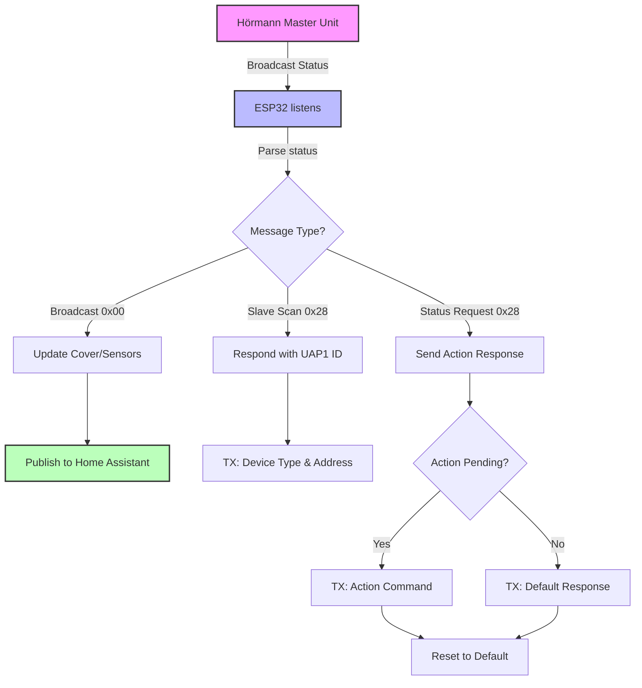

# Hörmann HCP1 ESPHome Controller

ESPHome custom component for controlling Hörmann garage doors using the HCP1 protocol over RS-485 (UART). This component allows you to integrate your Hörmann garage door with Home Assistant.

## Disclaimer
*Vibecoded hard with huge credits to:*
 - https://github.com/mapero/esphome-hcpbridge/
 - https://github.com/Gifford47/HCPBridgeMqtt

## Features

- **Cover Control**: Open, close, stop, and venting position
- **Light Control**: Toggle garage door light
- **Binary Sensors**: Error, pre-warning, and option relay status
- **Action Buttons**: Impulse and emergency stop
- Full support for Hörmann HCP1 protocol
- Built for ESP32 with ESP-IDF framework

## Hardware Requirements

### Components

- ESP32 development board
- MAX485 or similar RS-485 transceiver module
- Hörmann garage door unit with HCP1 bus

### Wiring Diagram

```
┌─────────────────┐
│     ESP32       │
│                 │
│  GPIO17 (TX) ───┼──────┐
│  GPIO16 (RX) ───┼────┐ │
│  GPIO4  (DE) ───┼──┐ │ │
│  GND ───────────┼┐ │ │ │
│  3.3V ──────────┼┼─┼─┼─┼──── VCC (3.3V/5V depending on module)
└─────────────────┘│ │ │ │
                   │ │ │ │
        ┌──────────┼─┼─┼─┼────────┐
        │  MAX485  │ │ │ │        │
        │          │ │ │ │        │
        │  VCC ────┼─┘ │ │        │
        │  GND ────┼───┘ │        │
        │  DE  ────┼─────┘        │
        │  RE  ────┼──────────GND │
        │  DI  ────┼──────────RX  │
        │  RO  ────┼──────────TX  │
        │  A   ────┼──────────┐   │
        │  B   ────┼────────┐ │   │
        └──────────┼────────┼─┼───┘
                   │        │ │
                   │     ┌──┴─┴─────────┐
                   │     │  Hörmann     │
                   │     │  HCP1 Bus    │
                   │     │              │
                   │     │  A (Data+)   │
                   │     │  B (Data-)   │
                   │     └──────────────┘
                   │
                   └─── Common Ground
```

### Pin Configuration

| ESP32 Pin | Function | MAX485 Pin |
|-----------|----------|------------|
| GPIO17    | UART TX  | DI         |
| GPIO16    | UART RX  | RO         |
| GPIO4     | DE/RE    | DE         |
| GND       | Ground   | GND        |
| 3.3V/5V   | Power    | VCC        |

**Notes:**
- Connect MAX485 RE to GND for receive mode by default (DE controls both)
- A and B from MAX485 connect to the Hörmann HCP1 bus (A = Data+, B = Data-)
- Ensure common ground between ESP32, MAX485, and Hörmann unit
- UART baud rate: **19200**

## Protocol Flow



### Protocol Details

1. **Bus Listening**: ESP32 listens on UART for messages from Hörmann master unit
2. **CRC Validation**: All messages validated using CRC8 checksum (poly: 0xF3)
3. **Message Types**:
   - **Broadcast (0x00)**: Status updates (door position, light, sensors)
   - **Slave Scan (0x28)**: Master queries for devices on bus
   - **Status Request (0x28)**: Master requests slave action response
4. **Response Timing**: ESP32 responds 3ms after receiving valid request
5. **DE Pin Control**: Switches MAX485 to TX mode before sending response

### HCP1 Protocol Constants

| Constant | Value | Description |
|----------|-------|-------------|
| BROADCAST_ADDR | 0x00 | Broadcast address |
| MASTER_ADDR | 0x80 | Master unit address |
| UAP1_ADDR | 0x28 | Universal access point address |
| UAP1_TYPE | 0x14 | Device type identifier |
| CMD_SLAVE_SCAN | 0x01 | Slave scan command |
| CMD_SLAVE_STATUS_REQUEST | 0x20 | Status request command |
| CMD_SLAVE_STATUS_RESPONSE | 0x29 | Status response command |

### Action Codes

| Action | Code | Description |
|--------|------|-------------|
| RESPONSE_DEFAULT | 0x1000 | No action |
| RESPONSE_EMERGENCY_STOP | 0x0000 | Emergency stop |
| RESPONSE_OPEN | 0x1001 | Open door |
| RESPONSE_CLOSE | 0x1002 | Close door |
| RESPONSE_IMPULSE | 0x1004 | Toggle/impulse |
| RESPONSE_TOGGLE_LIGHT | 0x1008 | Toggle light |
| RESPONSE_VENTING | 0x1010 | Venting position |

## Installation

### Method 1: Local Components (Development)

1. Clone this repository
2. Copy the `components/hoermann_controller` directory to your ESPHome configuration
3. Use the example configuration below

### Method 2: External Component (GitHub)

```yaml
external_components:
  - source:
      type: git
      url: https://github.com/silvercory/esphome-components
    components: [ hoermann_controller ]
```

## Configuration

### Basic Example

```yaml
esphome:
  name: garage-door
  friendly_name: Garage Door

esp32:
  board: esp32dev
  framework:
    type: esp-idf

# Enable logging
logger:

# Enable Home Assistant API
api:
  encryption:
    key: "YOUR_API_ENCRYPTION_KEY"

ota:
  platform: esphome
  password: "YOUR_OTA_PASSWORD"

wifi:
  ssid: !secret wifi_ssid
  password: !secret wifi_password

external_components:
  - source:
      type: local
      path: components

# UART configuration
uart:
  id: uart_bus
  tx_pin: GPIO17
  rx_pin: GPIO16
  baud_rate: 19200
  stop_bits: 1

# Hörmann controller
hoermann_controller:
  id: hoermann_door_controller
  uart_id: uart_bus
  de_pin: GPIO4

# Cover entity
cover:
  - platform: hoermann_controller
    hoermann_controller_id: hoermann_door_controller
    name: "Garage Door"

# Light switch
switch:
  - platform: hoermann_controller
    hoermann_controller_id: hoermann_door_controller
    type: light
    name: "Garage Door Light"
    icon: "mdi:lightbulb"

  - platform: hoermann_controller
    hoermann_controller_id: hoermann_door_controller
    type: venting
    name: "Garage Door Venting"
    icon: "mdi:fan"

# Binary sensors
binary_sensor:
  - platform: hoermann_controller
    hoermann_controller_id: hoermann_door_controller
    type: error
    name: "Garage Door Error"
    device_class: problem

  - platform: hoermann_controller
    hoermann_controller_id: hoermann_door_controller
    type: prewarn
    name: "Garage Door Pre-Warning"
    device_class: safety

  - platform: hoermann_controller
    hoermann_controller_id: hoermann_door_controller
    type: option_relay
    name: "Garage Door Option Relay"

# Action buttons
button:
  - platform: hoermann_controller
    hoermann_controller_id: hoermann_door_controller
    type: impulse
    name: "Garage Door Impulse"
    icon: "mdi:arrow-up-down"

  - platform: hoermann_controller
    hoermann_controller_id: hoermann_door_controller
    type: emergency_stop
    name: "Garage Door Emergency Stop"
    icon: "mdi:alert-octagon"
```

## Component Structure

```
components/hoermann_controller/
├── __init__.py                    # Main component registration
├── hoermann_controller.h          # Controller class definition
├── hoermann_controller.cpp        # Controller implementation
├── hoermann_cover.h               # Cover entity header
├── hoermann_cover.cpp             # Cover entity implementation
├── hoermann_switch.h              # Switch entities header
├── hoermann_switch.cpp            # Switch entities implementation
├── hoermann_button.h              # Button entities header
├── hoermann_button.cpp            # Button entities implementation
├── CMakeLists.txt                 # ESP-IDF build configuration
├── cover/
│   └── __init__.py               # Cover platform config
├── switch/
│   └── __init__.py               # Switch platform config
├── button/
│   └── __init__.py               # Button platform config
└── binary_sensor/
    └── __init__.py               # Binary sensor platform config
```

**Note**: Due to ESP-IDF limitations, all C++ source files (`.cpp` and `.h`) must remain in the main component directory. Only Python platform files can be organized in subdirectories.

## Available Entities

### Cover
- **Supports**: Open, Close, Stop, Position reporting
- **States**: Open, Closed, Opening, Closing, Venting

### Switches
- **Light**: Toggle garage door light
- **Venting**: Enable/disable venting position

### Binary Sensors
- **Error**: Door error status
- **Pre-Warning**: Safety pre-warning indicator
- **Option Relay**: Optional relay status

### Buttons
- **Impulse**: Send impulse command (toggle)
- **Emergency Stop**: Trigger emergency stop

## Troubleshooting

### Door not responding
- Check RS-485 wiring (A and B may be swapped)
- Verify UART baud rate is 19200
- Check DE pin is correctly configured
- Ensure common ground between all components

### CRC errors in logs
- Check for electrical interference on RS-485 bus
- Verify cable length is within RS-485 specifications (<1200m)
- Add termination resistors if needed (120Ω between A and B)

### Cover shows incorrect state
- Check status bit parsing in `hoermann_controller.cpp:96-115`
- Enable debug logging: `logger: level: DEBUG`

## License

This project is open source. Please check the repository for license details.

## Credits

Based on the Hörmann HCP1 protocol reverse engineering efforts.

## Contributing

Contributions are welcome! Please submit pull requests or open issues on GitHub.
